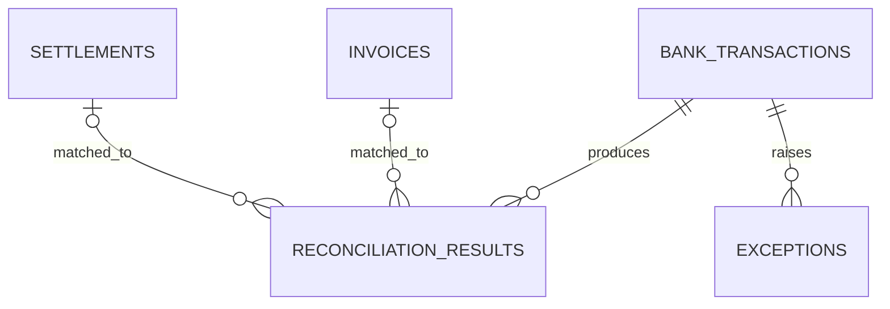

# Phase 3 — Database design

## Core entities



- **bank_transactions** stores normalized bank activity.
- **invoices** stores receivables and their payment state.
- **settlements** stores processor payout records, including normalized currency required by the Phase 6 ingestion pipeline.
- **reconciliation_results** stores evidence-backed match decisions. Invoice and settlement links are nullable because a decision may be unresolved.
- **exceptions** stores records requiring investigation and tracks resolution status.
- **cash_forecasts** stores one projected cash position per forecast date.

## Data rules

- IDs are application-generated UUID strings.
- Money uses `NUMERIC(18, 2)`; never floating-point types.
- Confidence uses `NUMERIC(5, 2)` and must be between 0 and 100.
- Currency uses three-character uppercase ISO-style codes.
- Foreign keys preserve traceability and use explicit delete behavior.
- Status, severity, transaction type, and risk level are protected by check constraints.
- Frequently filtered dates, references, statuses, customers, and foreign keys are indexed.
- `account_number` should contain a masked or tokenized value in production, not raw bank credentials.

## Applying the schema

```bash
docker compose up -d postgres
alembic -c backend/alembic.ini upgrade head
```

Rollback the initial schema with:

```bash
alembic -c backend/alembic.ini downgrade base
```
